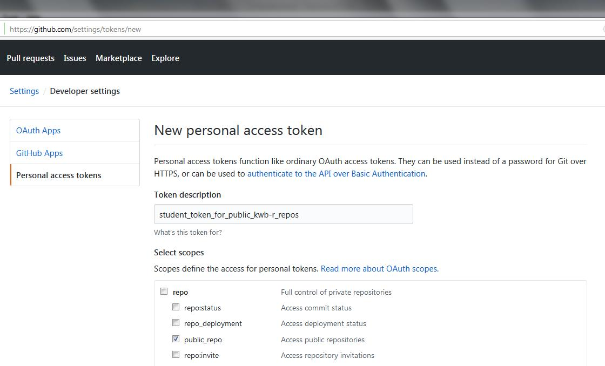
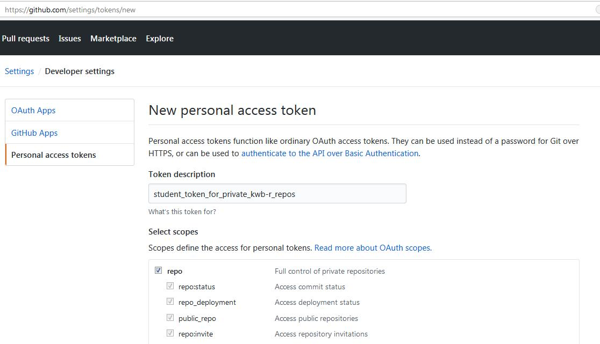
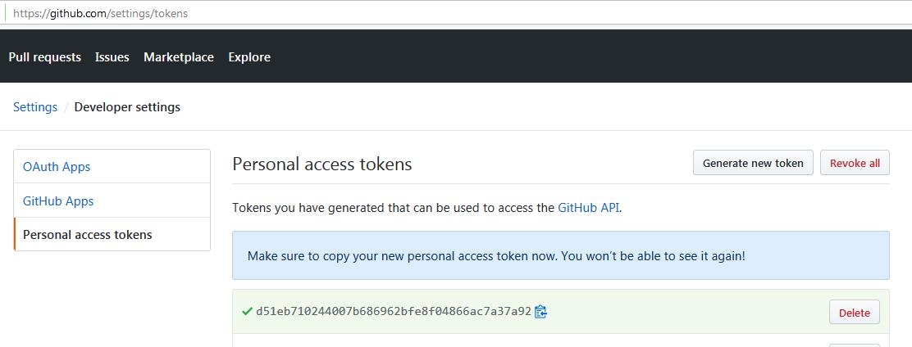
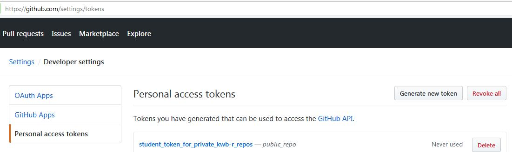
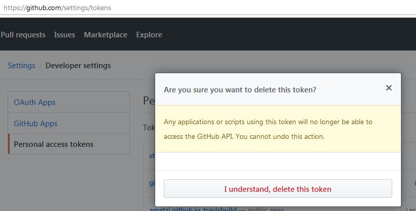

```{r setup, include = FALSE}
knitr::opts_chunk$set(
  collapse = TRUE,
  fig_caption = FALSE,
  comment = "#>"
)
```

# 1 GitHub Personal Access Token (GITHUB_PAT)

## 1.1 Create

KWB-R researchers need to create a GitHub Personal Access Token (PAT) for themselves
or their students at: 


https://github.com/settings/tokens/new


### 1.1.1 Public KWB-R packages

In case only access to public KWB-R packages (see [https://kwb-r.github.io/status](https://kwb-r.github.io/status)) 
is needed a `GITHUB_PAT` token with access to **public** repos only is sufficient (see below).





### 1.1.1 Private and Public KWB-R Packages

If also access to **private** KWB-R packages is required a **private** access token
needs to be generated (see below).




## 1.2 Copy 

Subsequently copy the `GITHUB_PAT` into a text file together with its **token_name**.





## 1.3 Delete 

If the student using the `GITHUB_PAT` does not need the it anymore it should be 
deleted as shown in the two screenshots below:





 


# 2 Installation 

## 2.1 Set your GITHUB_PAT

If you have a GitHub Personal Access Token (GITHUB_PAT)
please set it in your R(Studio) session as described below:

```{r github_pat, eval=FALSE}
Sys.setenv(GITHUB_PAT = "mysecret_access_token")
```

As we have a static IP address and GitHub API requests without providing a 
valid `GITHUB_PAT` are limited to **60 requests per hour per IP address**, 
you might get a error message similar to the one below: 

```{r api_error_message1, eval=FALSE}
remotes::install_github("kwb-r/kwb.ogre")
>Rate limit remaining: 0/60
>Rate limit reset at: 2018-10-21 14:28:34 UTC
>To increase your GitHub API rate limit
>- Use `usethis::browse_github_pat()` to create a Personal Access Token.
>- Add `GITHUB_PAT` to your travis settings as an encrypted variable.
>Execution halted
```
In addition if you require **[private and public](#private-and-public-kwb-r-packages)**  
KWB-R packages from GitHub but only provide a `GITHUB_PAT` with access to 
**[public](#public-kwb-r-packages)** KWB-R packages you might get a error 
message similar to the one below: 

```{r api_error_message2, eval=FALSE}
remotes::install_github("kwb-r/kwb.ogre")
> Error: HTTP error 404.
>  Not Found
```

## 2.2 Dependency

Install the R Package `remotes`, which is required for downloading and installing 
from GitHub: 

```{r install_dependency, eval=FALSE}
#Sys.setenv(GITHUB_PAT = "mysecret_access_token")
install.packages("remotes", repos = "https://cloud.r-project.org")
remotes::install_github("r-lib/remotes@18c7302637053faf21c5b025e1e9243962db1bdc")

```

## 2.3 KWB-R packages

Provide KWB-R packages to be installed:

```{r install_kwb_github_packages, eval=FALSE}

###############################################################################
### Define Function for Installing KWB-R GitHub Packages
###############################################################################

install_kwb_github_packages <- function(pkgs_kwb, 
                                        dependencies = TRUE,
                                        ...) {
  
  pkgs_kwb_github <- sprintf("KWB-R/%s", pkgs_kwb) 
  
  sapply(pkgs_kwb_github, FUN = function(gh_repo) {
  try(remotes::install_github(repo = gh_repo,
                              dependencies = dependencies, 
                              ...)
      )
    })
}


###############################################################################
### Use the Install Function For KWB-R Packages for Project BaSaR
###############################################################################


#### These R package dependencies are needed by BaSaR project

#library(kwb.base)
#library(kwb.monitoring) # for configure, pathDictionary, ...
#library(lubridate)      # for interval
#library(kwb.datetime)   # for hsToPosix
#library(kwb.utils)
#library(kwb.event)
#library(kwb.ogre)
#library(RCurl)


### But only two R packages need to be specified (since these two have the 
### missing KWB-R packages as dependencies, i.e. these will be installed 
### automatically! 
pkgs_kwb <- c("kwb.ogre", "kwb.monitoring")


install_kwb_github_packages(pkgs_kwb = pkgs_kwb)

```


