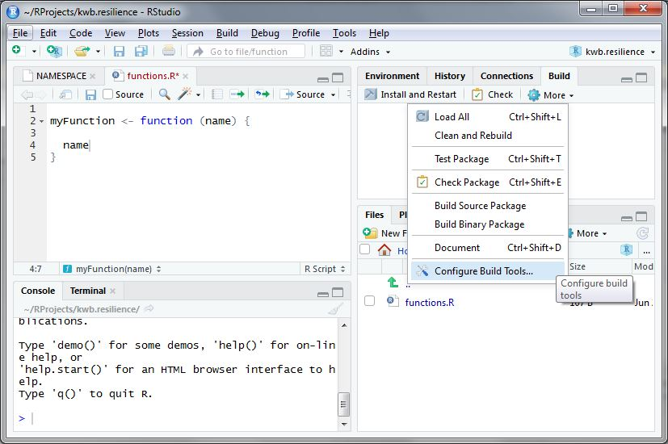
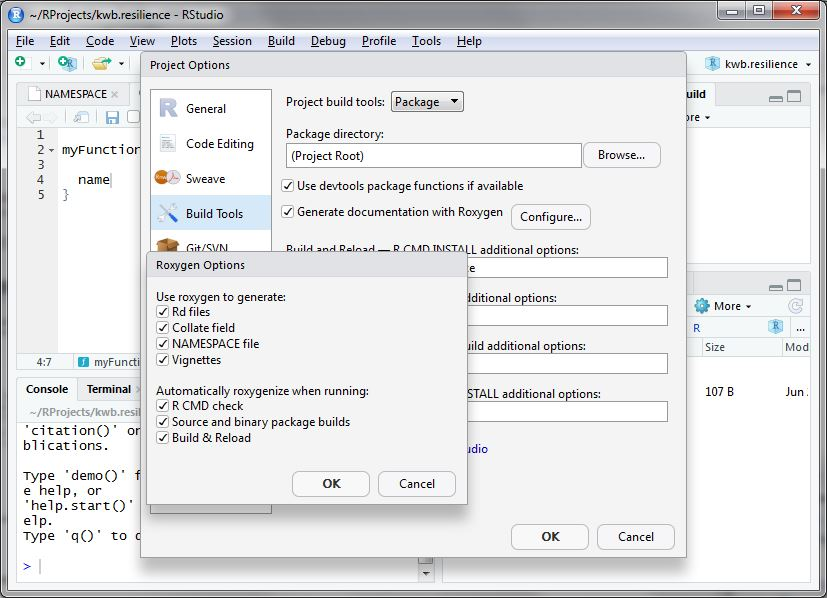

```{r setup, include = FALSE}
knitr::opts_chunk$set(
  collapse = TRUE,
  fig_caption = FALSE,
  comment = "#>"
)
```

This tutorial explains how you can develop an R package that already follows a
predefined default KWB package style. For example, a
[DESCRIPTION](http://r-pkgs.had.co.nz/description.html) file will be generated
for you. This file already contains some information that we want to have in all
our packages, such as KWB being the copyright holder of the package.

# 1 Install required R packages

First you need to install the following required R packages:

```{r, eval = FALSE}
# Get the names of already installed packages
installed_packages <- rownames(installed.packages())

# Install missing packages from "https://cloud.r-project.org"
# - remotes: functions for installing an R package from Github
# - pkgdown: functions for creating a package website
for (package in setdiff(c("remotes", "pkgdown"), installed_packages)) {
  
  install.packages(package, repos = "https://cloud.r-project.org")
}

# Install this package from our GitHub account
if (! "kwb.pkgbuild" %in% installed_packages) {
  
  remotes::install_github("KWB-R/kwb.pkgbuild")
}
```

# 2 Configure and create your package

Secondly you need to personalise your R package by adapting a default template
that we provide for KWB packages. This template is contained in the R package
`kwb.pkgbuild`.

## 2.0 Prepare a package directory

In the best case, your package will be under version control. We encourage you 
to create a GitHub repository on our [GitHub account](https://github.com/kwb-r)
that represents the package. Having a package as a repository on GitHub has the
advantage that it can be easily installed directly from there with no more than
running `devtools::install_github("kwb-r/<package_name>")`. Once you have 
created the GitHub repository, 
[clone](https://help.github.com/articles/cloning-a-repository/) it to a folder
on your local machine. 

You can let RStudio do the cloning for you. Therefore, 

* select "File > New Project..." from the main menu,
* select "Version Control > Git",
* set "Repository URL" to your new repository, such as 
`https://github.com/kwb-r/<package_name>`,
* set "Project directory name" to your `<package_name>` (this should be the 
default),
* set "Create project as subdirectory of" to the folder in which you want to
store your local copies of your github repositories, e.g. to `~/github-repos`.

For the steps described in the following, use the created package folder instead 
of `temp_pkg` so that your package template will be created direcly in the 
correct location.

## 2.1 Create empty R package

```{r}
# Set the name for your new package
package <- "kwb.newpackage"

# Set the path to your new package
temp_pkg <- file.path(tempdir(), package)

# Create a default package structure
usethis::create_package(path = temp_pkg,open = FALSE)

# Delete the original DESCRIPTION file
fs::file_delete(path = file.path(temp_pkg, "DESCRIPTION"))
```

## 2.2 Parameterise your R package

In the following, we present the commands required to setup and create your new
package. We suggest that you write the corresponding code into a `.R` script
file (e.g. `setup_package.R`). Once the package is created, we suggest to put
the script file into the `inst/extdata` folder of your package. This makes the
creation of the package reproducible and can be used as a template for the
creation of further packages.

## 2.2.1 Author

Minimum requirement: the author needs at least to have a (full) name:

```{r}
author <- list(name = "Max Mustermann")
```

You can add further information such as a personal website or the
[ORCID](https://orcid.org/) of the author:

```{r}
author <- list(
  name = "Michael Rustler", 
  orcid = "0000-0003-0647-7726",
  url = "http://mrustl.de"
)
```

The ORCID uniquely identifies the author of a web ressource and thus allows to 
find different works of one and the same author on the web.

If you do not know your ORCID, have a look at our package 
[kwb.orcid](https://github.com/kwb-r/kwb.orcid). It allows to search ORCIDs
by name, once you have created an account at [orcid.org](https://orcid.org/).

In addition, this package stores the ORCIDs of KWB researchers of whom we know 
their ORCID. Once you have kwb.orcid installed, you can access these ORCIDs 
with:

```{r eval = FALSE}
kwb.orcid::get_kwb_orcids()
```

## 2.2.2 Package description

The package description needs three entries

- **name**: name of the package

- **title**: title of your R package (which is automatically converted to title 
case with the function `tools::toTitleCase()`)

- **desc:** package description. Should be at least one sentence long and 
needs to end with a period!

```{r}
description <- list(
  name = package, 
  title = "My new KWB R package", 
  desc  = "My super cool new R package in KWB default styling."
)
```

## 2.3 Create R package structure in KWB-R style 

Running the following code not only creates an R package structure but also adds 
some KWB-R specfic styling, e.g.: 

- Adding configution files for: 
    
    + Continous integration on windows (https://appveyor.com) and linux
    (https://travis-ci.org/KWB-R)
    
    + Code coverage in R package using the servive [codecov.io](codecov.io)
    
    + Backup of Github repositories on our mirrored KWB-R group on
    [Gitlab](https://gitlab.com/KWB-R)

- Indicates the current lifecycle of the R package according to
https://www.tidyverse.org/lifecycle/

- Uses by default the permissive
[](https://opensource.org/licenses/MIT)
for all public R packages currently hosted on Github (see:
http://kwb-r.github.io/status/) and lists KWB as copyright holder (see e.g.
[here](https://kwb-r.github.io/kwb.pkgbuild/dev/authors.html))

- Creates `README` files (`README.Rmd` and `README.md`) for the above mentioned
topics and

- Prepares a KWB-R flavored documentation website template named
`_packagedown.yml` needed by http://pkgdown.r-lib.org/

Running the following R function will create the R package with the `version` = 
`0.0.0.9000` and development stage `experimental` (defined [here](https://www.tidyverse.org/lifecycle/#experimental)).

```{r eval = FALSE}
setwd(temp_pkg)

kwb.pkgbuild::use_pkg(
  author, 
  description, 
  version = "0.0.0.9000", 
  stage = "experimental"
)
```

## 2.4 Add your R functions

Add your R functions in the folder `R`/. By using `usethis::use_r` with the 
parameter `name` = `function` an empty R script is already stored in the right 
folder `R/`.

```{r eval = FALSE}
usethis::use_r("function")
```

For writing your R code/functions please follow the tidyverse coding style 
(https://style.tidyverse.org/), which serves as our default KWB-R style.

Now you just need to fill it with content (i.e. your functions) and document it 
using [roxygen2](https://cran.r-project.org/web/packages/roxygen2/vignettes/rd.html). 
If you have already defined a function you can add a [roxygen2](https://cran.r-project.org/web/packages/roxygen2/vignettes/rd.html)
skeleton by using clicking on the `Insert Roxygen Skeleton` button in RStudio 
as shown below. 


More information on documentation in R is provided here: 
[http://r-pkgs.had.co.nz/man.html](http://r-pkgs.had.co.nz/man.html)

# 3 Check your package

Once you completed all the steps above go to the upper right panel in RStudio 
and click on `Build` -> `More` -> `Configure build tools` as shown below. 



Then click on `Configure` and a new window opens. Here you select everything 
as shown below:



After doing so accept the settings by two times clicking `Ok`. 

Subsequently click the `Check` button so that your package is cross-checked for
possible problems (e.g. wrong documentation, missing package dependencies).

In case of missing package dependencies as shown below these should be added to 
the [DESCRIPTION](http://r-pkgs.had.co.nz/description.html) file.

```{r eval = FALSE}
Namespace dependencies not required: 'fs' 'httr' 'stringr' 'usethis' 'yaml'
See section 'The DESCRIPTION file' in the 'Writing R Extensions'
manual.
* DONE
Status: 1 ERROR

See
  'C:/Users/myname/Documents/RProjects/kwb.pkgbuild.Rcheck/00check.log'
for details.

checking package dependencies ... ERROR
Namespace dependencies not required: 'fs' 'httr' 'stringr' 'usethis' 'yaml'
```

This can be done using the function `usethis::use_package()` as shown below: 

```{r eval = FALSE}
pkg_dependencies <- c('fs', 'httr', 'stringr', 'usethis', 'yaml')

sapply(pkg_dependencies, usethis::use_package)

✔ Adding 'fs' to Imports field in DESCRIPTION
● Refer to functions with `fs::fun()`
✔ Adding 'httr' to Imports field in DESCRIPTION
● Refer to functions with `httr::fun()`
✔ Adding 'stringr' to Imports field in DESCRIPTION
● Refer to functions with `stringr::fun()`
✔ Adding 'usethis' to Imports field in DESCRIPTION
● Refer to functions with `usethis::fun()`
✔ Adding 'yaml' to Imports field in DESCRIPTION
● Refer to functions with `yaml::fun()`
```

Subsequently you should re-click on the `Check` button again and it should
finish without errors.

```{r eval = FALSE}
R CMD check results
0 errors | 0 warning  | 0 note 

R CMD check succeeded
```

# 4 Build your package

Now you are ready for building your R package by clicking on the `Install and
Restart` button. A successful installation should finish with `Done` as shown
below:

```{r eval = FALSE}
** building package indices
** installing vignettes
** testing if installed package can be loaded
* DONE (kwb.pkgbuild)
In R CMD INSTALL
```

# 5 Document your package

## 5.1 Manually

Finally you should run `pkgdown::build_site()` in order to create an
documentation website for your R package. Running this command will store the
website in the subfolder `docs` within your R package.

```{r eval = FALSE}
pkgdown::build_site()
```

Once you upload your R package to Github this can be easily used as
documentation page that you define in the settings page for your R package which
is available at:

https://github.com/KWB-R/  `kwb.mycoolrpackage`  /settings


## 5.2 Automatically

In case you have already a Github repo defined for your R package you can 
also automate the process of updating the `pkgdown::build_site()` by with the 
wrapper function `kwb.pkgbuild::use_autopkgdown()`, which: 

- creates a new branch "gh-pages" where the documentation site is deployed

- sets "docs" folder to ".gitignore" (as these files are now build on Travis)

- prepares Travis-CI by: 

   + adding secret key with `travis::use_travis_deploy()`

   + creating ".travis.yml" with `kwb.pkgbuild::use_travis(auto_build_pkgdown = TRUE)`
   
   + creating an empty "gh-pages" branch with 
   `kwb.pkgbuild::create_empty_branch_ghpages()`

```{r eval = FALSE}
kwb.pkgbuild::use_autopkgdown()
```

Finally to need to go to: 

https://github.com/KWB-R/  `kwb.mycoolrpackage`  /settings

and set the "source" for Github Pages to the branch "gh-pages". After each 
successful Travis build the documentation website is now also updated!
